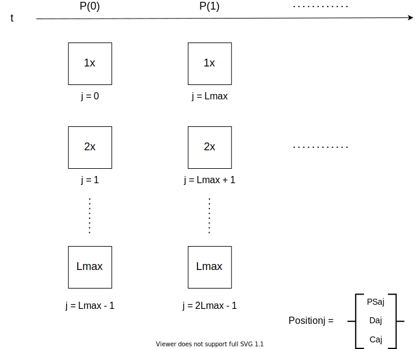

# Overlay Protocolにおけるレバレッジ機能について

---
note: 5
oip-num: 1
title: マーケットコントラクトにおける簿記処理
status: WIP
author: Michael Feldman (@mikeyrf), Adam Kay (@mcillkay)
discussions-to: oip-1
created: 2021-04-25
updated: N/A
---

本ノートで扱うべき問題:

- レバレッジとファンディングレートの支払いを伴う、P2PプールモデルのOverlay マーケットコントラクトにおいてのピアツープールモデルの帳簿処理の概要

## 背景

Overlay Protocolでは、従来市場のように、ポジションの取得時にカウンターパーティに反対側のポジションを取らせずに、ユーザーがデータ市場に対してポジションを取得できます。このような仕組みはP2Pプールモデルにより実装されます。ユーザーは、プロトコルの通貨( _$OVL_ )を、Overlay マーケットコントラクトプールにある時点\\(t = 0 \\)でロックし、代わりに自分のポジションの証明となるポジショントークンを受け取ります。この瞬間よりも未来のある時点 \\(t > 0 \\) でポジションを決済したい場合、ユーザーはOverlay マーケットコントラクトにより、ポジショントークンをバーンすることで決済できます。この時、コントラクトはポジションの精算時の利益・損失を補償するため、ユーザーが最初にロックしたものより多くまたは少なく $OVL を返却します。

ユーザーがポジションの決済時に利益を得る場合、マーケットコントラクトは実現利益に対する補償として、必要な分のOVLをmintし、流通枚数に追加します。その後、マーケットコントラクトは、最初にロックした担保($OVL)と新たにmintした$OVLをユーザーに返却します。

逆に、ポジションの決済時に損失が発生する場合、マーケットコントラクトは、最初にロックされた担保($OVL)を必要なだけバーンすることで、実現損失に対する補償として必要な$OVLを流通枚数から取り除きます。その後、マーケットコントラクトは、ロックされた担保からバーンされた損失分を差し引いた量の$OVLをユーザーに返却します。

このように、プロトコルを利用する$OVL保有者は、$OVLの通貨自身の希薄化のリスクを通じて、Overlay市場の全てのアンバランスなポジションのカウンターパーティーとして組み込まれます。特に、ユーザーがOverlay Protocolに出入りする際の流動性となる、OVL-ETH 流動性プロバイダー（LP）が含まれます。

レバレッジと[資金調達の支払い](注-1)がない、簡単な例で説明します。

ある時点\\( t = 0 \\)で・・・

- $OVLの流通枚数: 8,000,000 OVL かつ、10 OVL を保有しているとします。

- 10 OVL を \\( X \\) データ市場において、\\( x=100 \\) のエントリー価格でロングポジションを取得するため、ロックします。

未来のある時点\\( t > 0 \\)で・・・

- The \\( X \\) データ市場において、\\( X \\) は20%価格が上昇したとします。\\( x=120 \\) の価格において、ポジションを決済して利益を得ました。

- マーケットコントラクトは 2 OVLを生成し、流通枚数に 2 OVL を追加します。また、コントラクトは我々に 12 OVL を返却します。

- $OVLの流通枚数: 8,000,002 OVL かつ、 12 OVL を保有しています。

逆に、\\( X \\) の価格が20%下落した場合、マーケットコントラクトは2 OVLをバーンし、流通枚数からも2 OVL減少させ、我々に8 OVLを返却します。つまり終了時の流通枚数は7,999,998 OVLで、我々の残高は 8 OVLとなるはずです。

P2P プールモデルにレバレッジとファンディングを含めると、より複雑な帳簿状況になり、複数のポジションとユーザーをガス効率良く処理する必要があります。このノートの目的は、このようなダイナミクスにおける帳簿処理の概要を説明することです。

## レバレッジとファンディングに関するダイナミクス

### アプローチ

レバレッジとファンディングを伴うP2Pプールモデルを考えるとき、マーケットコントラクトにおけるロックされたOVL担保のユーザーごとシェアと、ユーザーのポジションサイズの合計（以後ユーザーの「建玉」と呼びます）の両方を追跡する方法を考える必要があります。ここで、ロング \( l \) (ショート \( s \)) サイドでの新規ポジション取得時、ユーザーに帰属する建玉を、担保としてロックされた $OVL(N)にレバレッジ(L)を掛けたものと定義します。サイド \\( a \in \\{ l, s \\} \\)をもつポジション \\(j \\) について、ポジション \\(j \\) 構築時点 \\( t = 0 \\) でのOI(Open Interest)を \\( \mathrm{OI}\_{aj} (0) \\) と記載すると、次のように定式化できます:

\\[ \mathrm{OI}\_{aj} (0) = L_{aj} \cdot N_{aj}(0) \\]

ここで、 \\( L_{aj} \\) は初期レバレッジで、 \\( N_{aj}(0) \\) はポジション \\( j \\) が構築された時点 \\( t = 0 \\) でロックされた担保のOVLです。

先ほどの例の発展編として、3倍のレバレッジという強気でのポジションを構築しましょう。

時刻0において、

- \\( X \\) データ市場において、価格 \\( x = 100 \\) にて成行でロングポジションを構築します。この際、10 OVLを担保としてロックします。

- マーケットコントラクトはこのポジションをOI(Open Interest) 30 OVL としてマークし、10 OVLは担保となり、20 OVLは負債となります。

ファンディングがなければ、ピア・ツー・プールモデルの実装は比較的簡単になります。マーケットコントラクトは、ユーザーごとにロックされた担保に対して、別のトークンを発行することでPnLを決定するためにポジションに設定されていた初期レバレッジをトラックできます。自分や他人のポジションの建玉が時間とともに変化することを心配する必要はありません。しかし、ファンディングの場合は、*担保と建玉* がプールされた量として扱われるため、状況はより複雑になります。あるサイドの建玉を集計することで、その建玉に対するユーザーのシェアは時間の経過とともに変化します。

### OI(Open Interest)に対するシェア

ファンディング支払いは、マーケットのロングとショートの建玉を調整させるために必要です。これまでの説明では、マーケットコントラクトは、単純な定期的な移動、すなわちロング（ショート）側の建玉の総量の一部をショート（ロング）側の建玉の総量に移動させるようなトランザクションを生成出来ると仮定していました。このような資金供給は、[システムの持つリスク](note-4)を引き下げ、十分な時間がたてば、最終的に市場におけるポジションサイズをリバランスします。ある時間 \\( t \\) でのファンディング支払いは以下のようになります:

\\[ \mathrm{FP} (t) = k \cdot \mathrm{OI}\_{imb}(t) \\]

ここで \\( {\mathrm{OI}\_{imb}} (t) = {\mathrm{OI}_l} (t) - {\mathrm{OI}_s} (t) \\) はマーケットにおけるロング \\( l \\) ・ショート \\( s \\) ポジションの建玉の不均衡の総量です。 \\( k \in [0, \frac{1}{2}] \\) はマーケットごとのパラメータ（ガバナンスで調整可能）で、 \\( a \\) サイドポジションによる建玉の総量は、 \\( a \\) のポジションごとの建玉の総和として計算されます:

\\[ \mathrm{OI}\_{a} = \sum_{j} \mathrm{OI}\_{aj} \\]

未決済建玉の連続的な移動は、プール内の総担保量($OVL)及び未決済建玉に対するユーザーごとのシェアにどのように影響するでしょうか。

通常、ファンディング支払いでは、ロング (ショート) ポジションはショート (ロング) ポジションに対してロックされた担保金額から直接支払いを行い、ファンディング支払いは保有するポジションに起因する建玉の量に比例して分配されるはずです。しかし、この場合、アンバランス解消のために建玉を更新しようとすると、コントラクトはすべての許容されるレバレッジ及び双方の担保プールにおけるシェアをループして処理する必要があります。理想的とはいえず、直ちに問題が発生します。さらに、リスクの分析は、非常に複雑になっています。

あるサイドのポジションの建て玉合計に対するシェアがファンディング支払い前後でも一定と仮定しましょう。マーケットでの取引では、ポジションの担保を確保・追加する代わりに、ポジションに対応する建て玉を移動させることができます。ファンディング支払い前の時刻 \\( t \\) からファンディング支払い後の \\( t + 1 \\) において、サイド \\( a \\) における建て玉は次のように表現できます：

\\[ \mathrm{OI}\_l (t+1) = \mathrm{OI}\_l (t) - \mathrm{FP}(t) \\]

\\[ \mathrm{OI}\_s (t+1) = \mathrm{OI}\_s (t) + \mathrm{FP}(t) \\]

各ポジションが支払い・受け取る資金量はポジションの建て玉へのシェアに比例して配分されます：

\\[ \mathrm{OI}\_{aj} (t+1) = \mathrm{OI}\_{aj} (t) \; (\mp)\_a \; \mathrm{PS}\_{aj} \cdot \mathrm{FP}(t) \\]

ここで、 サイド \\( a \\) に対して、\\( a  = l \\) の時には \\( (\mp)\_a = -1 \\) 及び \\( a = s \\) の時には \\( (\mp)\_a = +1 \\) として、 \\( \mathrm{PS}\_{aj} \equiv \frac{\mathrm{OI}\_{aj} (t)}{\mathrm{OI}\_{a} (t)} \\) はポジション \\( j \\) の建て玉合計に対するシェアとして表現されます。

\\( m \\) によるファンディング支払いの後、OIはリバランスを通して次のように減少します：

\\[ \mathrm{OI}\_{imb} (t+m) = \mathrm{OI}\_{imb} (t) \cdot ( 1 - 2k )^{m} \\]

充分な時間経過の後、建て玉はロングポジション・ショートポジションの間で均等化されます。合計のロング・ショートポジションの建て玉の合計はファンディング支払いの前後で代わりません：

\\[ \mathrm{OI} = \mathrm{OI}\_{l} + \mathrm{OI}\_{s} = \mathrm{const} \\]

ファンディング支払いは簡単に実装できます。[``periodSize``](note-2) ブロックごとに、オラクルからのデータ取得に応じて段階的にファンディング支払いを行います。最後の更新から、\\( t+m \\) の時刻、つまり \\( m \\) の時間間隔でファンディング支払いを分割して実行する個tで、マーケットにおけるOIは次のように調整されます：

\\[ \mathrm{OI}\_{l} (t+m) = \frac{1}{2} \bigg[ \mathrm{OI}\_{l} (t) + \mathrm{OI}\_{s} (t) + (\mathrm{OI}\_{l} (t) - \mathrm{OI}\_{s} (t)) \cdot ( 1 - 2k )^{m} \bigg] \\]

\\[ \mathrm{OI}\_{s} (t+m) = \frac{1}{2} \bigg[ \mathrm{OI}\_{l} (t) + \mathrm{OI}\_{s} (t) - (\mathrm{OI}\_{l} (t) - \mathrm{OI}\_{s} (t)) \cdot ( 1 - 2k )^{m} \bigg] \\]

ここで、 \\( \\{\mathrm{OI}\_{l} (t) は更新前の値で、\mathrm{OI}\_{s} (t) \\} \\) は不変となるOI総量を表したものです。 <!-- TODO: エッジケースとして、片方のポジションのOIがゼロの場合を考えましょう -->

ユーザー \\( i \\) として私たちがポジション \\( j \\) ([ERC-1155](https://eips.ethereum.org/EIPS/eip-1155)) の一部を保有していたとすると、その時刻でのOI合計に対する私たちのシェアは次のように表せます：

\\[ \mathrm{OI}\_{aij}(t) = \mathrm{S}\_{aij} \cdot \mathrm{PS}\_{aj} \cdot \mathrm{OI}\_{a}(t) \\]

ここで、 \\( \mathrm{S}\_{aij} \equiv \frac{\mathrm{OI}\_{aij}(t)}{\mathrm{OI}\_{aj}(t)} \\) をユーザー \\( i \\) のポジション \\( j \\) に対するシェアとしています。

### 担保金の処理

ユーザーごとの建玉に対するシェアと、マーケットでの取引に際しロックされた担保のシェアは、ポジションの価値を算出するために必要なので、ポジションクローズ時にユーザーに返却するOVLの量も必要な情報です。

これまでの記載より、時刻 \\( t \\) におけるポジション \\( j \\) の価値は担保のシェア及びOIに対するシェアを用いて、次のように表されます：

\\[ V_{aj} (t) = N_{aj} (t) \; (\pm)_a \; \mathrm{OI}\_{aj} (t) \cdot \bigg( \frac{P(t)}{P(0)} - 1 \bigg) \\]

ここで、 \\( P(i) \\) はオラクルによって取得された市場の価値（エントリーから \\( i \\) ブロック後）であり、時刻 \\( 0 \\) はポジションのオープン時刻として定義します。ロングポジション \\( a  = l \\) の時には、 \\( (\pm)\_a = +1 \\) とし、ショートポジション \\( (\pm)\_a = -1 \\) の時には、 \\( a = s \\) となります。

ファンディング支払いが完了した後、担保金額 \\( N_{aj} (t) \\) をポジション \\( j \\) に割り当てるにはどうすればいいでしょうか。ここでは、担保金額を直接ファンディング支払いに当てているわけではないので、この答えは明確ではありません。各レバレッジに対して残高を計算して、ループの上担保金額を更新することなく、全体のOI総額を更新出来るのが理想的です。

代わりに、初期レバレッジ \\( L_{aj} \\) を用いて、システムに対して負う、ポジション  \\( j \\) の負債を次のように定義します：

\\[ D_{aj} \equiv \mathrm{OI}\_{aj} (0) - N_{aj} (0) = N_{aj} (0) \cdot (L_{aj} - 1) \\]

ファンディング支払いの間はポジション \\( j \\) に紐づく負債の総額は一定とし、支払いごとに更新しません。時刻 \\( t \\) において、ポジション \\( j \\) の価値は次のように表されます：

\\[ V_{aj} (t) = \mathrm{OI}\_{aj} (t) \cdot \bigg[ 1 \; (\pm)\_a \; \bigg( \frac{P(t)}{P(0)} - 1 \bigg) \bigg] - D_{aj} \\]

ここで、時刻 \\( t \\) において、ポジション \\( j \\) に割り当てられている担保金は次のように表現されます：

\\[ N\_{aj} (t) \equiv \mathrm{OI}\_{aj} (t) - D_{aj} \\]

従って、任意の時刻 \\( t \\) に対してポジションの価値を評価するには、各ポジション \\( j \\) に対して次のような定数（ファンディング支払いの間変化しない定数）を持たせることが必要です:

- \\( \mathrm{PS}_{aj} \\) --  ポジション \\( j \\) の \\( a \\) サイド建て玉合計に対するシェア

- \\( D_{aj} \\) -- ポジション \\( j \\) のシステムに対する負債

- \\( C_{aj} \\) -- ポジション \\( j \\) のオープン時のコスト、つまり初期の担保金である \\( N_{aj}(0) \\) ($OVL)

- \\( P(0) \\) -- マーケットオラクルから取得されるポジション \\( j \\) のエントリー価格

プール量は動的に変化するか、上限は \\( a \\) サイドごとのOI合計 \\( \mathrm{OI}\_{a}(t) \\) で決まります。

ここで、ポジション \\( j \\) に対してエントリー価格 \\( P(0) \\) を静的な定数として割当てることは、ユーザーがポジションのオープン時刻 \\( t = 0 \\) より後に担保を追加することが出来ないことを想定してのことです。この要件により、ポジションのシェア自体は交換可能です（複数のユーザーがポジションの一部を保有できます）が、ポジション自体は交換不可能な、準交換可能な実装を可能にできます。ポジションをトークン化(ERC-1155)することにより、他のDeFiプロトコルとのコンポーザビリティやセカンダリーでのポジションの売買を可能に出来るので、このアプローチを推奨しています。

### アンワインド時のリターン

ポジション \\( j \\) を構築するとき、システムはポジションサイズ \\( \mathrm{OI}_{aj}(0) \\) を満たすような負債 \\( D\_{aj} \\) をマーケットコントラクトに生成します。これは、一方のOIがゼロ（(ロングORショート)のポジションがない）場合に、ファンディング支払いによって対応するようなケースです。このような場合、システムは次のように、リスクを引き下げるためにファンディング支払いを直接バーンさせることが出来ます。なぜなら、マーケットコントラクトはバーン出来るOVLを保有しているためです：

\\[ \mathrm{OI}\_{lj}(t+m) = \mathrm{OI}\_{lj}(t) \cdot (1 - 2k)^m \\]

\\[ \mathrm{OI}\_{sj}(t+m) = \mathrm{OI}\_{sj}(t) = 0 \\]

しかし、ポジション構築時のサイズを実現するためには、PnLを考慮したうえで、アンワインド時に対応する負債 \\( D\_{aj} \\) をバーンする必要があります。時刻 \\( t \\) におけるポジション \\( j \\) のPnLは次のように表されます：

\\[\mathrm{PnL}\_{aj}(t) = V_{aj}(t) - C_{aj} = \mathrm{OI}\_{aj} (t) \cdot \bigg[ 1 \; (\pm)\_a \; \bigg( \frac{P(t)}{P(0)} - 1 \bigg) \bigg] - \mathrm{OI}_{aj}(0)\\]

アンワインドの時刻 \\( t \\) では、マーケットコントラクト \\( V_{aj}(t) \\) はポジション \\( j \\) を解消するユーザーに対してOVL建てで返金します(ここで、ポジションを1人のユーザーしか保有していないと仮定しています)。ポジション \\( j \\) の利益が他のポジションの未払い負債を上回った場合、システムはマーケットコントラクトにおいて差額である \\( \mathrm{PnL}\_{aj}(t) - D_{aj} \\) を生成し、ポジションの価格をユーザーに返却します。逆に利益・損失が負債を下回る場合、システムは差額 \\( D_{aj} - \mathrm{PnL}\_{aj}(t) \\) をバーンし、ポジションの残りの価値をユーザーに返却します。

複数のユーザーがポジション \\( j \\) のシェアを保有している場合でも話は簡単で、利益・損失、価値、コスト、負債を ユーザー \\( i \\) へシェアに応じて案分します。例えば、時刻 \\( t \\) においてユーザー \\( i \\) がポジション \\( j \\) を保有しています。アンワインド時に返却される価値は \\( \mathrm{S}_{aij} \\) シェアを保有している場合に次のように表されます。この時、ポジションの関連するシェアも同時にバーンされるので、重複してアンワインドされることを防止します。
\\( \mathrm{S}_{aij} \\) はポジション構築時に生成されます：

\\[ V_{aij}(t) = \mathrm{S}_{aij} \cdot V\_{aj}(t) \\]

### ポジショントークン

*TODO:*

1. 時刻 \\( T+1 \\) においてオラクルが取得したデータを元に、ポジション構築をキューに入れます。
2. それぞれの異なるレバレッジに対して定義されるプライスポインタは時刻 \\( T+1 \\) で定められ、不変です。つまり、価格は時刻 \\( T+1 \\) における次のオラクルによるデータ取得まで、未入力になる要素を含むようなリストになります。
3. ポジション \\( j \\) はサイド \\( a \\) の全OIに対するシェア \\( \mathrm{PS}\_{aj} \\) として付与されます。
4. ポジション構築時、ユーザー \\( i \\) はポジション \\( j \\) のシェア及び関連する担保・負債・建て玉を受け取ります。このポジションは ERC1155 で生成され、ポジションのシェア自体は交換可能です（複数のユーザーがポジションの一部を所有できます）。しかし、ポジション自体は交換出来ません。
5. 私たちはロングサイド・ショートサイドのOIの合計を追跡しています。それぞれのポジション \\( j \\) はこのポジションに関わる負債及び担保の合計額に加え、追跡しているOIのシェアが割り当てられています。
6. オラクルによるデータ取得つまり更新期間の後、新しいロング・ショートサイドのポジション構築がレバレッジ上限 \\( L_{\mathrm{max}} \\) の上でキューに追加されます。次のオラクルによるデータ取得 \\( T+1 \\) までに追加されます。
7. 時間経過に応じて変化する変数はロングもしくはショートサイド一方のみのOIを集計したものです。

### マージンと清算について
